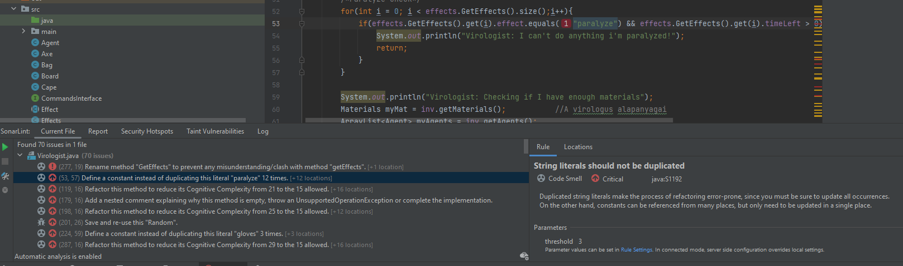
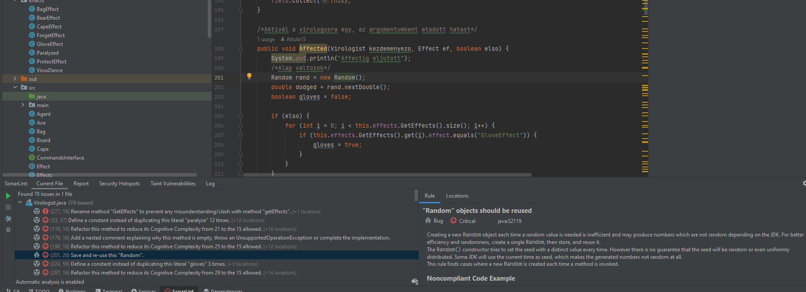

Hérincs Bence

A Virologist.java fájlban a SonarLint eléggé sok hibát talált, ezek közül 2db-ot eléggé fontosnak is gondolok:

     

     

Ezeket Issukba le is jelentettem. "Virologist Random" és "String kiszervezés" neveke.