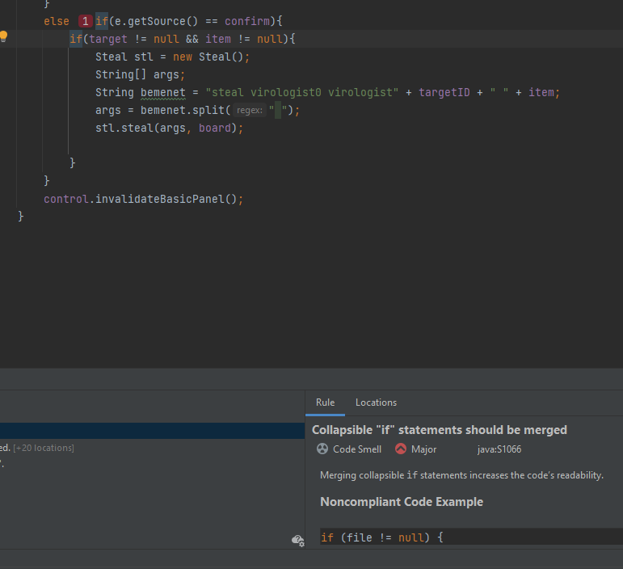

Hérincs Bence Attila

Kaptam egy olyan issue-t, melyben az alábbi 3 helyen csökkentenem kell a kognitív komplexitást: **OtherAttackActionListner**, **OtherStealActionListener**, **ApplyEffect**. Erről a feladatkörről már olvastam egy előző issue-nál, így ebben az md fájlban részletesen nem fejteném ki, csak amennyiben valami újat csinálok.

Első lépésként kerestem, hogy van-e olyan rész, amit egy switch-el lehetne helyettesíteni. Találtam is az **OtherAttackActionListner**-ben.

A SonarLint az OtherStealActionListener-ben talált egy másik code smell-t:

     

Ez alapján azzal, ha összeolvasztom a két if-et(amiben semmi nem állít meg, mivel más amúgy se történne abban az ágban, csakis akkor, ha a második if is teljesül), akkor azzal növelhetem a kódnak a megbízhatóságát.

Amennyiben az alsó if-nek a feltételét egy külön, beszédesebb nevű függvénybe szervezem ki, akkor igen, ez valóban egy könyebben olvasható, könnyebben karbantartható kód lesz. (A SonarLint által mutattott példakódban is így szerepel)

Az **OtherStealActionListener**-ben találtam egy **kód duplikálást**, aminek kiszereverzésével a komplexitást is megoldottam. A kiszervezést a "setWhichButtonShouldBeVisible" függvényben valósítottam meg.

Az **ApplyEffect**-ben keresés közben találtam egy másik ajánlást amit a SonarLint generált, miszerint ha a **substring** paranncsal a az adott string elején keresünk, akkor van egy másik egyszerűbb alternatíva a **startwith()** függvény. Erről nem tudtam, hogy létezik, de most már aktívan fogom tudni használni.

Az **ApplyEffect**-et tovább vizsgálva elég nehezen találtam olyan megoldást, amivel a komplexitást lehetne csökkenteni. Végül úgy döntöttem, hogy az **applyEffect** függvény elején lévő két bemenetet ellenőrző if-et összeolvasztom és kiszervezem egy külön függvénybe. Ez lett az **inputSyntaxCheck(String[] args)**