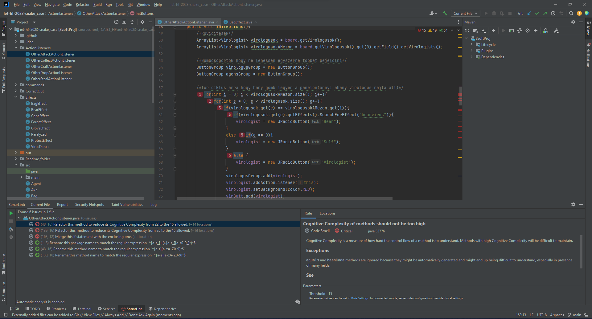

Cseszka Bence és Hérincs Bence Attila

Előkészítettük a repot, hogy maven-el fordítható legyen, hogy később hozzá lehessen adni a SonarCloud tehcnológiát.

Ezek után lokálisan az IntelliJ IDE-be telepítettük a SonarLint plugint, majd teszteltük azt:

     

A hibát felvettük Issue-ba "Túl komplex függvény hívás" néven. Későbbiekben ezt lehetőleg javítani is fogjuk.