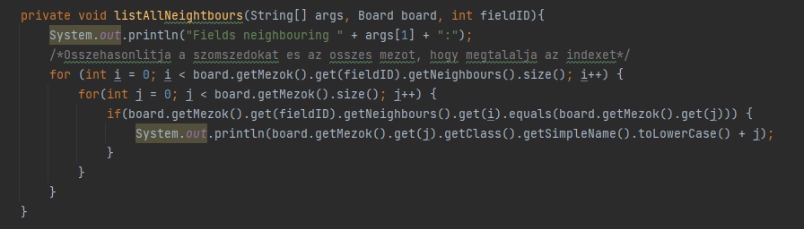
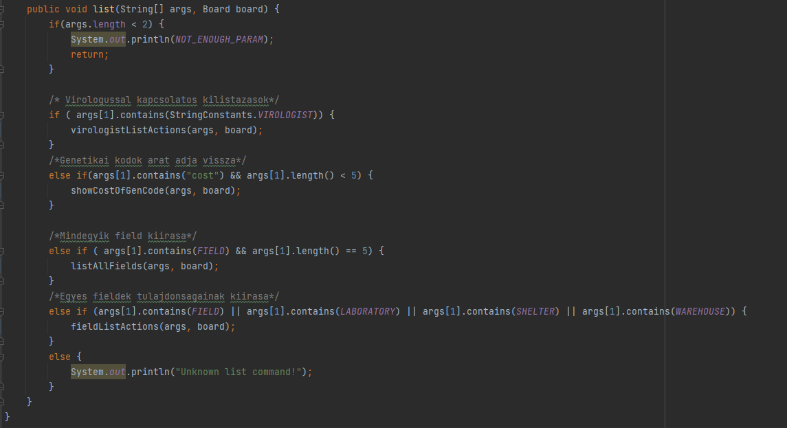

Illés Ákos

Hiba: a List.java osztály list függvényénak túl nagy a komplexitása (106), ez a kódot közel olvashatatlanná teszi.

Amikor először megláttam a hibát nem tudtam mit kezdjek vele, ezért elolvastam a SonarLint erről szóló dokumentációját.
Ebben megtanultam, hogy mi alapján ad a SonarLint pontszámot a komplexitásra pl.: egymásba ágazott if vagy for ciklusok nagyon nöbelik a komplexitást és minél több van egy függvényben annál több pontot fog adni rá.
Ahogy végigfutottam a kódot azt vettem észre, hogy rengeteg if-else blokk van a függvényben és mind egymás után következnek. Lényegében csak a kommentek miatt tudtam hogy éppen mit csinál az adott kód, ezért úgy döntöttem, hogy a függvényt szétszedem tzöbb kisebb függvényre és ezeknek beszédes nevet adok pl.:

Ilyen és ehhez hasonló függvények írásával sokkal átláthatóbb lett a kód, és a SonaLint függvénykomplexitással kapcsolatos problémája is eltünt.
A végső feldarabolt függvényből ennyi maradt:

Tanulság: Ez a feladat remekül szemléltette velem, hogy mennyire nehéz is olvasni a nagy komplexitású függvényeket. Ennek a tudásnak fényében a jövőben el fogom kerülni az ilyen függvények írását. Ehelyett inkább feldarabolom a függvényeimet több kisebbre beszédes nevekkel.