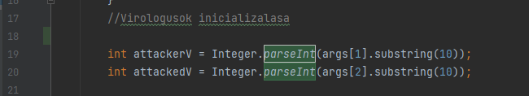
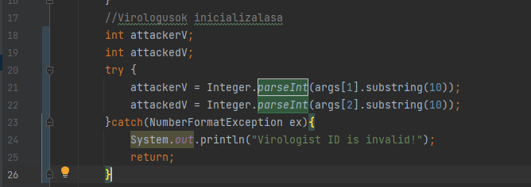

Illés Ákos

Hiba: észrevettem, hogy pár helyen, amikor a játék írásos formában játszódik, akkor olyan utasításokat használunk, amleyek számokat kezelnek a parseInt() függvénnyel, ám ezek a függvényhívások nincsenek védve a hibás userinput ellen. Akkor, ha a felhasználó hibásan adja meg a bemenetet és a parseInt() nem talál számot benne, akkor ez kivételt dob, amit nem kezelünk.

Megoldás: try-catch blokkba teszem ezeket a parseInt() hívásokat.

Ilyen és ehhez hasonló parseInt() hívások majdnem mindegyik osztályban előfordultam a commands mappában, ezért sokmindent kellett javítanom.