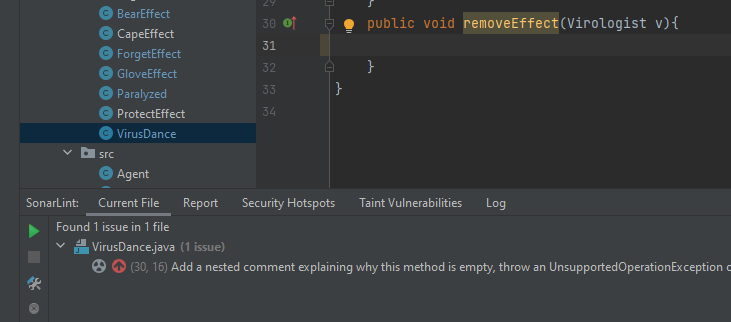
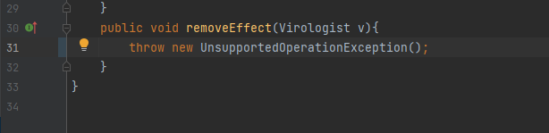

Illés Ákos

Hiba: Az effect absztrakt osztályt implementáló osztályok egy részének nincs szüksége a removeEffect függvényre, ezért üresen állnak. Ezeket soha nem fognak csinálni semmit, ezért valami hibát kéne dobniuk, ha véletlenül meghívnák őket. 

Megoldás: Mivel ezek a függvények üresek, ezért nem is kéne, hogy valaki meghívja őket. Inkább figyelmeztetni kell azt, aki ezt a jövőben meg akarná hívni, hogy ez nem csinál semmit. Erre jó megoldás dobni egy kivételt.

Ezeknek a függvényeknek azért van szükségük a removeEffect implementálására mert az effect abstract osztályból származnak le és ez az osztály tartalamaz egy removeEffect függvényt, ám pár effect ezt nem használja.

Később észrevettem, hogy ez a probléma több osztályban is fennáll, ezért azokat is kijavítottam.