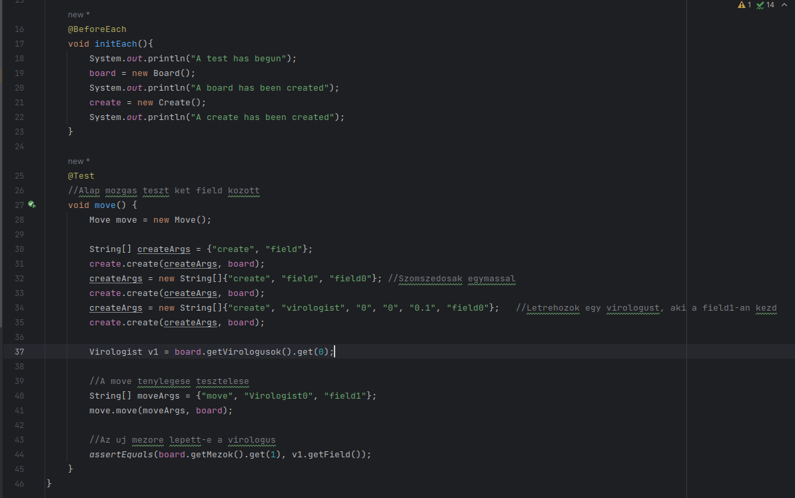
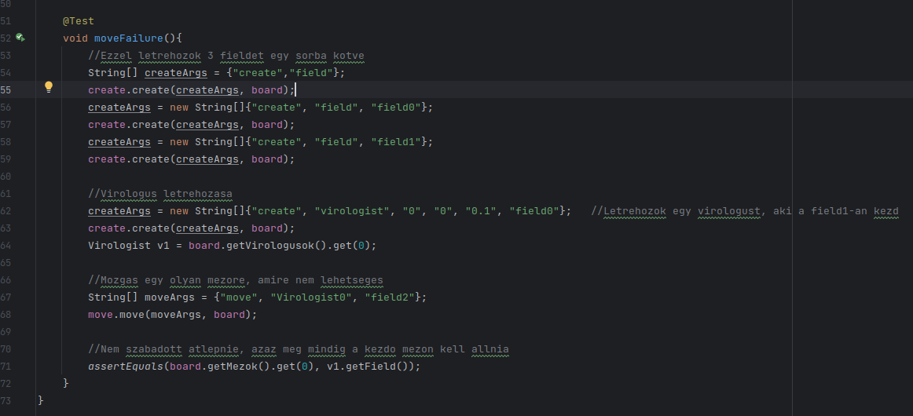
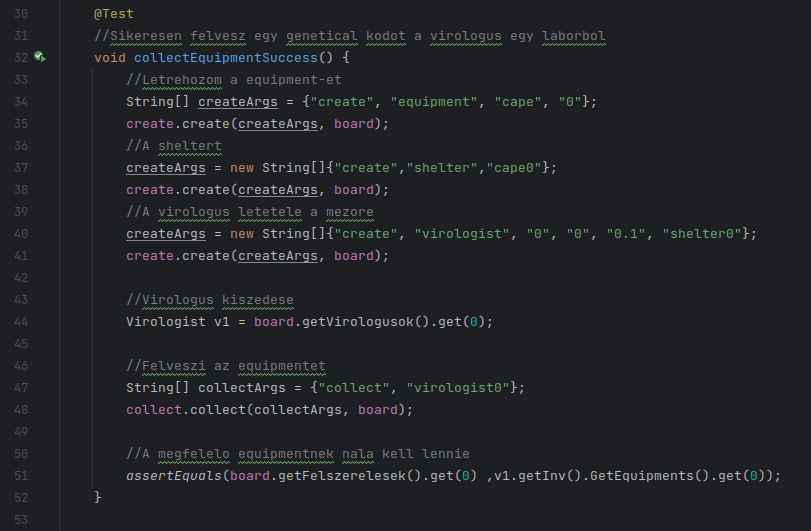
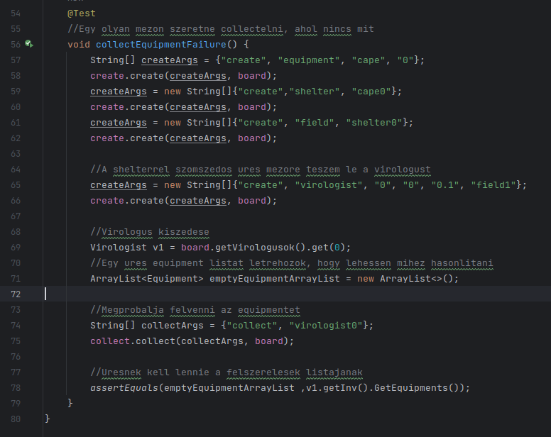

Hérincs Bence Attila és Cseszka Bence

## Bevezető

Első lépésként készítettünk egy "UnitTests" nevü mappát, amiben a Unit tesztek fognak elhelyezkedni.
Ezek után végiggondoltuk, hogy melyik alapvető funkcióval lenne érdemes kezdeni, ehhez elővettük a dokumentációnkat, amit még az eredeti projecthez csináltunk és ott végignéztük az akkori teszteket.

Ezen tesztek közül elsőnek a move parancsot választottuk 1. tesztként.
Ezt a UnitTests/MoveTest.java fájlban a "move" függvényben teszteljük.

A tesztesetek lebonyolítására elsőnek arra gondoltunk, hogy felhasználjuk a már megírt teszt .txt fájlokat, illetve a régebben megírt load függvényt. Azonban problémákba ütköztünk, mivel a load függvény nem a UnitTest-ekhez lett írva, így elég nehéz lenne összehozni, hogy működjön velük.

A load függvényt tanulmányozva azonban támadt egy olyan ötletünk, hogy a már előre megírt test .txt-ket fel tudnánk használni a unit tesztek során is. Beolvassuk a fájlt, feldaraboljuk a sorait, majd betápláljuk a testbe.

## Move teszt 1

Miután jobban végiggondoltuk, rájöttünk, hogy nem érné meg ez a megoldás, sokkal bonyolultabb lenne és nem nyernénk vele eleget, emiatt elvetettük és egy ilyen megoldással jöttünk helyette:

     

## Move teszt 2

Következőnek egy sikeretelen move-ot szerettünk volna tesztelni.

Tervezés közben észrevettük, hogy a boardban(Board.java) lévő arraylistek nem nullázódnak, amikor új board jön létre. Ez a program futása szempontjából fölösleges, viszont a teszteléseket megnehezíti, emiatt kivettük a "static" kulcsszót az arraylistek elöl.

Ezek után megírtuk a sikeretelen move tesztet:

     

## Collect equipment teszt 1

Ebben a tesztben azt teszteljuk, hogy ha a virologus egy olyan mezon all, amiben van valami (esetünkben egy felszerelés), akkor azt fel tudja venni és utána bekerül az invertoryába.

     

## Collect equipment teszt 2

Ebben a tesztben azt szeretnénk tesztelni, hogy ha van egy mezo amiben van valami, azonban a virológus nem azon collectel, akkor véletlenül se kerüljön be az invertoryába az a dolog (esetünkben egy felszerelés)

     

